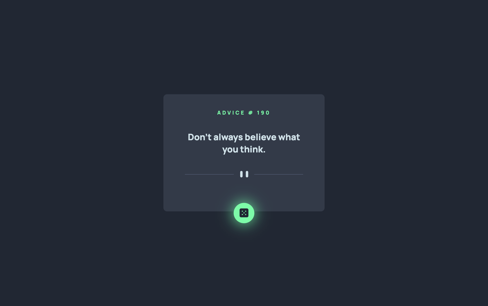
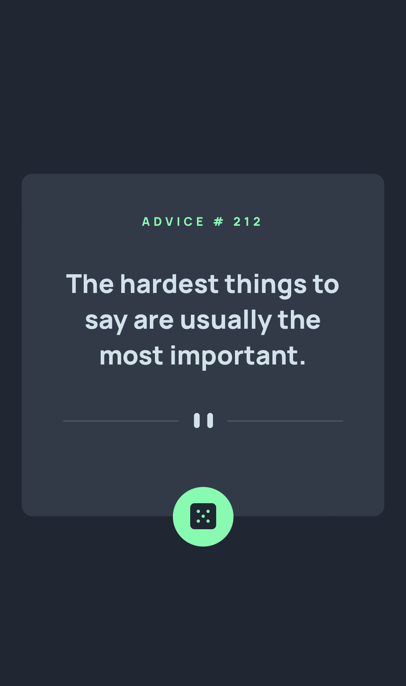

# Frontend Mentor - Advice Generator App

This is my solution to the [Advice Generator App challenge on Frontend Mentor](https://www.frontendmentor.io/challenges/advice-generator-app-QdUG-13db). This challenge incorporated an API call to Advice Slip API.

### Live Solution Link
[Live Solution](https://chrisk-adviceapp.netlify.app/)

### Screenshot

### Built with

- HTML5
- CSS
- Flexbox
- JavaScript (Fetch API)
- Advice Slip API